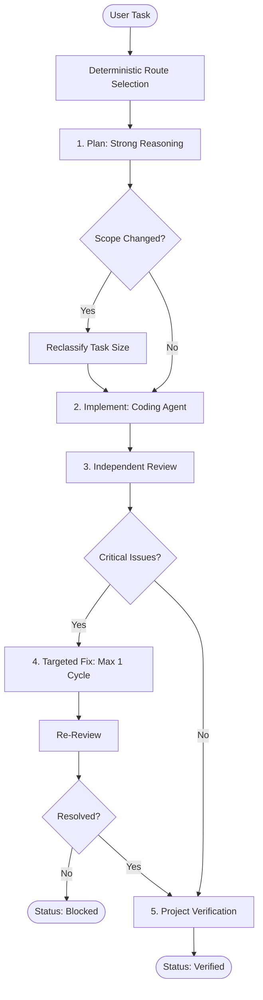
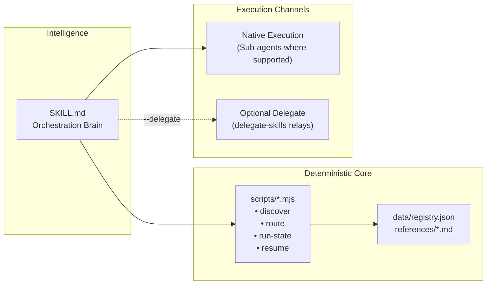

# Adaptive Orchestrator

[](https://nodejs.org)
[-blue.svg)](#skill-first-architecture)
[](#skill-first-architecture)
[](LICENSE)

> **One task in. The right agents take it from there.**

Adaptive Orchestrator is a skill-first orchestration layer for AI coding agents. Give it one development task and it routes planning, implementation, review, and verification to the right available agent, model, and reasoning effort.

Instead of using one expensive model for everything—or trusting a weak agent with architecture and review—it uses stronger reasoning only where it matters and specialized coding agents where they fit best.

```text
               User Task
                   ↓
         Adaptive Orchestrator
                   ↓
Plan  →  Implement  →  Review  →  Verify
 ↓           ↓            ↓
Best        Best     Independent
Agent       Coder     Reviewer
```

---

## Why Adaptive Orchestrator?

Most multi-agent coding workflows hit three common bottlenecks:

1. **Weak models on critical phases:** A session started with a fast or lightweight model might attempt complex architectural planning or security review by itself.
2. **Wasted reasoning tokens:** Running every mechanical edit or typo fix on maximum reasoning effort burns quota without improving output quality.
3. **Manual coordination fatigue:** Developers spend time manually typing: *"Now plan... now code this file... now review your own work... now fix this."*

```text
Without Adaptive Orchestrator:
Task → Same Agent → Same Model → Same Effort → Self-Review (blind spots)

With Adaptive Orchestrator:
Task → Plan: Reasoning-focused → Implement: Coding-focused → Review: Independent → Verify: Automated
```

---

## What It Does

| Phase | Adaptive Decision |
|---|---|
| **Plan** | Assigns a capable reasoning model to inspect the repository and produce bounded steps |
| **Implement** | Routes implementation work to a specialized coding agent |
| **Review** | Employs an independent agent to catch errors the implementer missed |
| **Fix** | Automatically triggers one focused repair cycle if critical issues are found |
| **Verify** | Runs project-aware commands (`test`, `analyze`, `build`) before concluding |

Routing dynamically evaluates:
- User explicit overrides (`config.yaml`)
- Configured delegate-skills fleet lanes
- Built-in capability registry scores
- Selected budget policy (`conservative`, `balanced`, `quality`)
- Locally installed, authenticated agents

---

## What Makes It Different?

Adaptive Orchestrator does not try to reinvent sub-agents, external CLI delegation, or the standard `Plan → Implement → Review` cycle. Those building blocks already exist.

Its primary value is the **adaptive routing layer above them**:

```text
User Task
   ↓
Which agent?
   ↓
Which model?
   ↓
Which reasoning effort?
   ↓
Native sub-agent or external delegate?
   ↓
Execute with isolated handoff
```

By decoupling *who decides* from *who executes*, any supported agent can act as a coordinator without being forced to perform roles it is unsuited for.

---

## Quick Start

Adaptive Orchestrator is designed as an agent skill with zero external package dependencies.

### 1. Clone the repository

```bash
git clone https://github.com/tamourax/Adaptive-Orchestrator.git
cd Adaptive-Orchestrator
```

### 2. Run environment setup

Inspects locally installed agent CLIs (`claude`, `codex`, `agy`, `cursor`, etc.) and detects delegate fleets:

```bash
node scripts/setup.mjs
```

### 3. Run self-test

Verify that all deterministic routing and state handlers are functioning:

```bash
node scripts/smoke-test.mjs
```

### 4. Use with your agent

Load `SKILL.md` into your preferred coding agent (e.g. Claude Code, Antigravity, OpenCode, Codex). In your agent prompt:

```text
Use $adaptive-orchestrator to implement Stripe checkout in Flutter
```

> **Note:** The scripts in `scripts/` are deterministic helpers invoked by the skill. Adaptive Orchestrator is a skill-first system, not a standalone CLI framework.

---

## Example

*Example scenario — actual routing depends on your locally installed agents and configuration:*

**Task:** `"Implement Stripe in Flutter"`

```text
Plan
→ Claude / High Effort

Implement
→ Codex / Medium Effort

Review
→ Claude / High Effort (Independent Reviewer)

Verify
→ Flutter analyze + test suite
```

### Review & Fix Flow

```text
[Review Phase]
⚠ 1 CRITICAL issue detected: PaymentIntent confirmed twice on retry
      ↓
[Fix Phase]
Implementer receives targeted fix brief containing only the critical issue
      ↓
[Re-Review Phase]
Independent reviewer verifies the fix
      ↓
[Verification Phase]
flutter test passes
      ↓
Status: Verified
```

---

## How Routing Works

The execution sequence follows a strict, verifiable lifecycle:



### Decision Priority Chain

When selecting the agent for each phase, `scripts/route.mjs` applies a 4-level decision rule:

1. **User Override:** Hardcoded preference in `~/.adaptive-orchestrator/config.yaml`
2. **Delegate Lane:** Matching lane in `fleet.yaml` (when `--delegate` is active)
3. **Capability Registry:** Best available model meeting phase minimum score thresholds
4. **Fallback:** Default host agent

---

## Skill-First Architecture

> *"Reasoning stays with agents. Deterministic operations stay in scripts."*

Adaptive Orchestrator divides responsibilities cleanly:



- **`SKILL.md`:** The brain. Instructs the orchestrating agent how to interpret task sizes, coordinate stages, and handle findings.
- **`scripts/`:** Pure Node.js built-ins. Performs file I/O, routing rule evaluation, and state tracking without LLM calls.
- **`data/registry.json`:** Baseline model capability scores and phase thresholds.
- **`references/`:** Detailed schema, rule, and handoff documentation.
- **Native Execution:** Default path. Uses native execution capabilities exposed by the host agent (sub-agents where supported).
- **Delegate Execution:** Optional path. Connects to `delegate-skills` when external CLIs are requested.

---

## Core Principles

| Principle | Rule |
|---|---|
| **Zero Runtime Dependencies** | Built using only Node.js standard libraries (`node:fs`, `node:child_process`, `node:path`). |
| **Independent Review** | The implementer context never reviews its own work. |
| **Severity-Based Gates** | Findings must be labeled `CRITICAL` (blocks completion), `WARNING` (reported), or `SUGGESTION` (advisory). |
| **Loop Boundary** | Maximum 1 automated fix cycle. Prevents endless token-burning review loops. |
| **Max Reasoning Opt-in** | `max` effort is disabled by default and requires explicit `--allow-max` authorization. |
| **Context Isolation** | Phases pass structured briefs via disk rather than carrying bloated conversational context. |
| **No Auto-Commits** | Code changes remain unstaged/uncommitted. The final commit belongs to the developer. |

---

## Handoff & Run Workspace

To prevent context dilution across long tasks, every run maintains an isolated workspace on disk:

```text
.adaptive-orchestrator/runs/<run-id>/
├── metadata.json          # Machine state, timestamps, and current phase
├── task.md                # Original user task and boundary constraints
├── plan.md / plan.json    # Architectural plan (human markdown + machine JSON)
├── implementation.md/json # Changes made and touched files list
├── review.md / review.json# Reviewer analysis and categorized findings
└── final.md / final.json  # Automated test logs and final verdict
```

Each agent receives only the brief relevant to its phase. For example, the Reviewer receives `task.md`, `plan.md`, `implementation.md`, and the current Git diff—nothing more.

---

## `delegate-skills` Integration

Adaptive Orchestrator supports [delegate-skills](https://github.com/amElnagdy/delegate-skills) as an optional execution channel:

- **Default:** Native execution using host agent capabilities.
- **Optional (`--delegate`):** Allows routing work to configured `delegate-skills` fleet lanes (e.g. sending coding tasks to Codex, UI tasks to Cursor).

```text
Adaptive Orchestrator (Top-Level Controller)
         │
         ├── Phase: Plan      → Native Agent
         ├── Phase: Implement → delegate-skills (Codex)
         ├── Phase: Review    → Native Agent (Independent)
         └── Phase: Verify    → Native Agent
```

Adaptive Orchestrator always remains the top-level decision maker. External delegates act strictly as executors for designated phases.

---

## Configuration

Settings are saved in `~/.adaptive-orchestrator/config.yaml`.

```yaml
# Default reasoning budget: conservative | balanced | quality
defaultBudget: balanced

# Force specific agents for specific phases:
agentOverrides.plan: claude
agentOverrides.implement: codex
agentOverrides.review: claude
agentOverrides.verify: claude
```

### Capability Registry (`data/registry.json`)

Models have default scores (1–5) across three axes:

```json
"claude-sonnet-4-5": { "planning": 4, "coding": 4, "review": 4 },
"codex-default":     { "planning": 2, "coding": 5, "review": 2 },
"unknown":           { "planning": 1, "coding": 1, "review": 1 }
```

> **Note:** Scores are practical routing heuristics and sensible defaults, not scientific benchmarks. Users can adjust scores in `config.yaml` to match their own preferences. Unknown models receive conservative fallback handling.

---

## Scripts Reference

All helper scripts are located in `scripts/` and run on Node 18+:

| Script | Purpose | Example Usage |
|---|---|---|
| **`setup.mjs`** | Probes environment and writes initial config | `node scripts/setup.mjs` |
| **`discover.mjs`** | Outputs JSON of installed CLIs and fleet lanes | `node scripts/discover.mjs` |
| **`route.mjs`** | Computes deterministic routing for a phase | `node scripts/route.mjs --input '{"phase":"plan","budget":"balanced"}'` |
| **`run-state.mjs`** | Initializes workspaces and generates briefs | `node scripts/run-state.mjs build-brief --run-id <id> --phase plan` |
| **`resume.mjs`** | Finds interrupted runs for graceful recovery | `node scripts/resume.mjs` |
| **`smoke-test.mjs`**| Tests all scripts against standard cases | `node scripts/smoke-test.mjs` |

---

## Project Structure

```text
Adaptive-Orchestrator/
├── SKILL.md                          # Main skill instructions for AI agents
├── README.md                         # Documentation & architectural reference
├── LICENSE                           # MIT License
├── package.json                      # Script entry points (zero dependencies)
├── .gitignore                        # Ignores runs and temporary artifacts
│
├── data/
│   └── registry.json                 # Model capability scores and phase requirements
│
├── references/                       # Detailed specifications
│   ├── capability-registry.md        # Scoring rubric and minimum phase floors
│   ├── delegate-integration.md       # Delegate fleet protocol details
│   ├── handoff-schema.md             # JSON and Markdown schemas for run workspaces
│   └── routing-rules.md              # Task size classification and effort mapping
│
└── scripts/                          # Deterministic Node.js helpers (pure built-ins)
    ├── discover.mjs
    ├── resume.mjs
    ├── route.mjs
    ├── run-state.mjs
    ├── setup.mjs
    └── smoke-test.mjs
```

---

## Current MVP Scope

### Supported in MVP
- Small, Medium, and Large task classification with heuristic baselines
- Dynamic agent, model, and reasoning effort assignment per phase
- Native execution preference with optional external delegate support
- Strict independent code review
- Categorized findings (`CRITICAL`, `WARNING`, `SUGGESTION`)
- One-cycle automated critical fix loop
- Isolated run workspaces with resume capabilities
- Explicit budget modes (`conservative`, `balanced`, `quality`)
- Guarded `max` reasoning effort (opt-in only)

### Out of Scope for MVP
- Self-learning neural routing
- Automated live model benchmarking
- Real-time provider API quota inspection
- Multi-agent consensus voting
- Cloud dashboards or centralized telemetry

---

## Roadmap

Future iterations may explore:
- **Specialized Reviewers:** Dedicated security, database, and accessibility review lanes.
- **Benchmark-Informed Profiles:** Community-curated model capability presets.
- **Comparative Multi-Run:** Parallel evaluation of competing implementation branches.
- **Enhanced Run Metrics:** Granular latency and token tracking per phase.

---

## Contributing

Contributions, feedback, and issue reports are welcome. Please ensure that all script modifications adhere to the zero-dependency standard and pass `node scripts/smoke-test.mjs` before submitting pull requests.

---

## License

Licensed under the MIT License. See [LICENSE](LICENSE).
