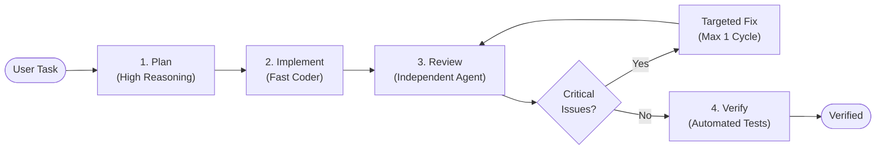

# Adaptive Director Skill

[](https://nodejs.org)
[-blue.svg)](#architecture)
[](LICENSE)

> **One task in. The right agents take it from there.**

**Adaptive Director Skill** is a lightweight, skill-first orchestration layer for AI coding agents. Give it a single development task, and it dynamically directs each phase—**Planning, Implementation, Review, Fixing, and Verification**—to the best available agent, model, and reasoning effort.

Instead of burning expensive reasoning tokens on simple edits or trusting a weak model with complex architecture and reviews, it directs work intelligently based on capability and budget.

```text
               User Task
                   ↓
         Adaptive Director
                   ↓
Plan  →  Implement  →  Review  →  Verify
 ↓           ↓            ↓
Best        Best     Independent
Agent       Coder     Reviewer
```

---

## Why Use It?

Running an entire task with a single agent often leads to three common problems:
- **Weak models on critical planning:** Lightweight models make architectural mistakes.
- **Wasted reasoning tokens:** Using maximum reasoning for minor code changes burns quota needlessly.
- **Review blind spots:** Agents struggle to catch their own errors during self-review.

### How It Solves This



| Phase | Adaptive Decision |
|---|---|
| **Plan** | Directed to a strong reasoning model |
| **Implement** | Routed to an efficient coding specialist |
| **Review** | Checked by an independent reviewer (never self-reviewed) |
| **Fix** | Automated 1-cycle fix for critical findings |
| **Verify** | Validated via project test suites (`flutter test`, `npm test`, `pytest`) |

---

## Quick Start

Adaptive Director runs with **zero external npm dependencies** (pure Node.js built-ins).

### 1. Clone & Setup

```bash
git clone https://github.com/tamourax/Adaptive-Orchestrator.git
cd Adaptive-Orchestrator

# Probe local agents (Claude, Codex, Antigravity, Cursor, etc.)
node scripts/setup.mjs

# Verify installation with smoke test
node scripts/smoke-test.mjs
```

### 2. Run with Your AI Agent

Load `SKILL.md` into your coding agent (Claude Code, Antigravity, Codex, etc.) and prompt:

```text
Use $adaptive-director-skill to implement Stripe checkout in Flutter
```

---

## Example Walkthrough

**Task:** `"Implement Stripe in Flutter"`

1. **Plan:** Claude (High Effort) inspects the repo and builds the execution plan.
2. **Implement:** Codex (Medium Effort) writes the code without committing.
3. **Review:** An independent Claude session inspects the diff.
   - *Finds 1 Critical issue:* PaymentIntent confirmed twice on retry.
4. **Fix:** Codex receives a targeted brief to fix only that critical bug.
5. **Re-Review:** Reviewer confirms the fix.
6. **Verify:** Runs `flutter analyze && flutter test`.
7. **Done:** Changes left uncommitted for final developer review.

---

## Architecture

> *"Reasoning stays with agents. Deterministic operations stay in scripts."*

```text
adaptive-director/
├── SKILL.md                 # The brain: instructions read by your AI agent
├── data/registry.json       # Baseline model capability scores (1–5)
├── references/              # Handoff schemas, rules, and delegate docs
└── scripts/                 # Deterministic Node.js helpers (pure built-ins)
    ├── discover.mjs         # Detects local agent CLIs
    ├── route.mjs            # Computes agent + effort assignments
    ├── run-state.mjs        # Manages isolated phase briefs & workspaces
    └── resume.mjs           # Recovers interrupted runs
```

### Routing Priority Order

1. **User Overrides:** Explicit settings in `~/.adaptive-director/config.yaml`
2. **Delegate Lanes:** Optional `delegate-skills` fleet lanes (when `--delegate` is active)
3. **Capability Registry:** Best available local model meeting phase requirements
4. **Fallback:** Default host agent

---

## Core Principles

- **Independent Review:** The coder never reviews its own work.
- **Max Reasoning Opt-in:** `max` effort is locked by default; requires `--allow-max`.
- **Runaway Loop Protection:** Maximum 1 automated fix cycle before alerting the user.
- **Context Isolation:** Each agent receives only a self-contained brief on disk (`.adaptive-director/runs/`), preventing context window bloat.
- **Zero Dependencies:** Runs on vanilla Node.js 18+.

---

## Configuration (`~/.adaptive-director/config.yaml`)

```yaml
defaultBudget: balanced # conservative | balanced | quality

# Optional overrides:
agentOverrides.plan: claude
agentOverrides.implement: codex
agentOverrides.review: claude
```

---

## License

MIT License © 2026 [Ahmed Tamer](https://github.com/tamourax). See [LICENSE](LICENSE) for details.
