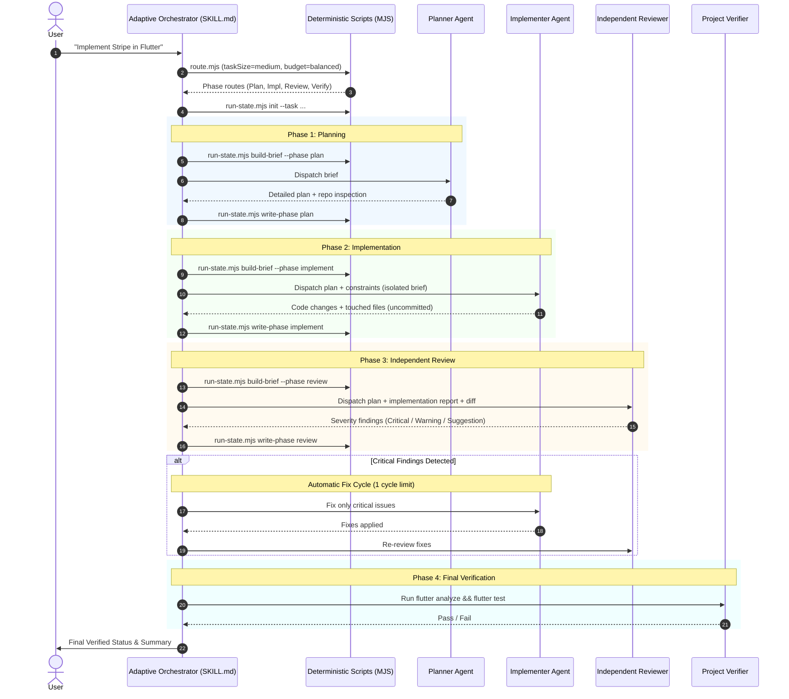
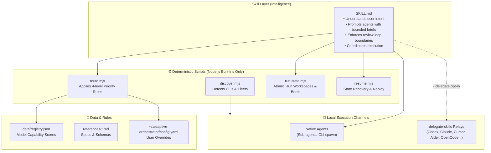
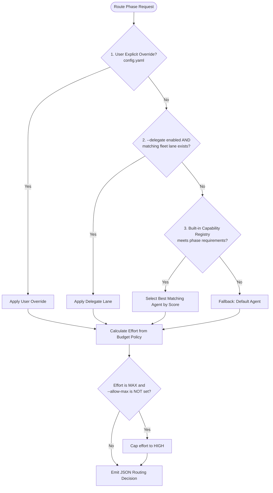
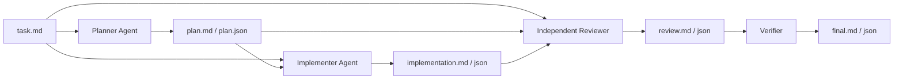
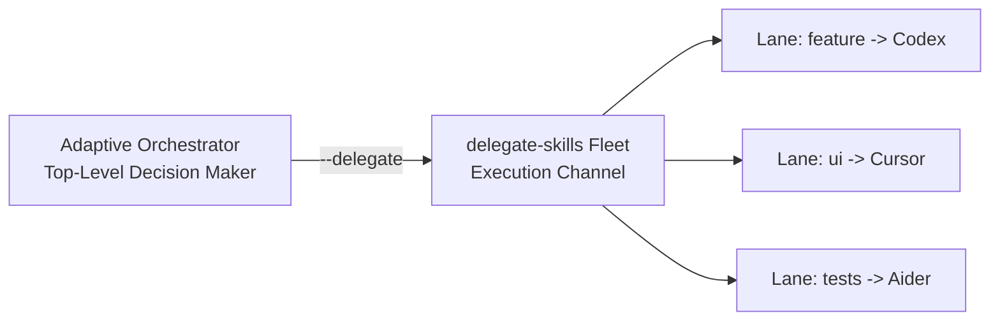

# Adaptive Orchestrator

[](https://nodejs.org)
[-blue.svg)](#architecture)
[](#overview)
[](LICENSE)

> **One task in. The right agents take it from there.**

**Adaptive Orchestrator** is a lightweight, skill-first orchestration layer for AI coding agents. Instead of running an entire development task through a single agent, a single model, and a static reasoning budget, Adaptive Orchestrator dynamically routes each phase—**Planning, Implementation, Review, Fixing, and Verification**—to the most qualified agent, model, and reasoning effort.

---

## Table of Contents

- [Overview](#overview)
- [The Problem](#the-problem)
- [Architecture & Diagrams](#architecture--diagrams)
  - [1. End-to-End Execution Flow](#1-end-to-end-execution-flow)
  - [2. System Architecture](#2-system-architecture)
  - [3. Decision & Priority Chain](#3-decision--priority-chain)
  - [4. Workspace & Handoff Isolation](#4-workspace--handoff-isolation)
- [Core Principles](#core-principles)
- [Directory Structure](#directory-structure)
- [Quick Start](#quick-start)
- [CLI Scripts Reference](#cli-scripts-reference)
- [Configuration & Overrides](#configuration--overrides)
- [Integration with delegate-skills](#integration-with-delegate-skills)
- [License](#license)

---

## Overview

Modern coding agents often suffer from two extremes:
1. **Under-resourced execution:** Complex planning and security reviews are handled by weak models or low effort, producing broken designs or overlooked vulnerabilities.
2. **Over-resourced waste:** Simple file edits or mechanical fixes consume costly high/max reasoning tokens.

Adaptive Orchestrator solves this by sitting as the **decision brain** above your local coding agents:

```text
               User Task
                   │
                   ▼
┌──────────────────────────────────────┐
│        Adaptive Orchestrator         │
│  (Skill Brain + Deterministic Core)  │
└──────────────────┬───────────────────┘
                   │
  ┌────────────────┼────────────────┐
  ▼                ▼                ▼
Plan           Implement          Review
(Strong Agent) (Coding Specialist)(Independent Agent)
High Effort    Medium Effort      High Effort
```

---

## The Problem

```mermaid
flowchart TD
  subgraph Traditional["❌ Traditional Single-Agent Execution"]
    T1[User Task] --> A1[Single Agent / Fixed Model]
    A1 --> P1[Plan]
    P1 --> I1[Implement]
    I1 --> R1[Self-Review: High Blind-Spot Risk]
    R1 --> C1[Commit without Independent Verification]
  end

  subgraph Adaptive["✅ Adaptive Orchestrator Execution"]
    T2[User Task] --> AO[Adaptive Orchestrator]
    AO --> P2["Plan: Strongest Reasoning (e.g. Claude / Opus / o3)"]
    P2 --> I2["Implement: Fast Coding Specialist (e.g. Codex / OpenCode)"]
    I2 --> R2["Review: Strict Independent Reviewer (e.g. Claude / Sonnet)"]
    R2 --> F2{"Critical Findings?"}
    F2 -- Yes --> FX["Fix Loop (Max 1 Cycle)"]
    FX --> R2
    F2 -- No --> V2["Verify: Project-Aware Tests & Gates"]
    V2 --> D2[Final Human Review & Landing]
  end
```



---

## Architecture & Diagrams

### 1. End-to-End Execution Flow



---

### 2. System Architecture

The project adheres to a strict separation between **agent reasoning** and **deterministic script execution**:



---

### 3. Decision & Priority Chain

Routing decisions are completely deterministic. `route.mjs` evaluates options strictly in this priority order:



---

### 4. Workspace & Handoff Isolation

Agents do **not** inherit massive, messy conversational transcripts. Instead, each run generates a self-contained workspace inside `.adaptive-orchestrator/runs/<run-id>/`:

```
.adaptive-orchestrator/runs/run-119894fa/
├── metadata.json          <-- Machine state: status, current phase, timestamps
├── task.md                <-- Pristine user requirements & boundary constraints
├── plan.md / plan.json    <-- Structured architectural decisions & checklist
├── implementation.md/json <-- Modified files, notes, and uncommitted diffs
├── review.md / .json      <-- Independent critique categorized by severity
└── final.md / final.json  <-- Verification verdicts & automated gate results
```



---

## Core Principles

| Principle | Description |
|-----------|-------------|
| **Pure Node.js Built-ins** | Zero runtime `npm` dependencies. No network callers, no credential handlers, no telemetry. Pure standard library (`node:fs`, `node:child_process`, `node:path`). |
| **Independent Review** | The implementer agent is **never** permitted to review its own code. Blind spots are caught by a fresh, unpolluted context. |
| **Severity Gate** | Findings are categorized as `CRITICAL` (must fix), `WARNING` (logged, non-blocking), or `SUGGESTION` (informational). |
| **Runaway Loop Protection** | Exactly **one** automatic fix and re-review cycle. If critical issues persist, the status changes to `Blocked` and requires user oversight. |
| **Max Reasoning Opt-in** | `max` reasoning is disabled by default to safeguard quotas. It can only be unlocked explicitly via `--allow-max`. |
| **Budget Awareness** | Three explicit budget modes: `conservative` (cost-optimized), `balanced` (recommended default), and `quality` (rigorous). |
| **No Auto-Commits** | Relays and implementers leave changes in the working tree. Committing belongs exclusively to the user or orchestrator after review. |

---

## Directory Structure

```text
adaptive-orchestrator/
├── SKILL.md                          # The brain: instructions and operational behavior
├── README.md                         # Complete documentation and architecture guide
├── package.json                      # Command shortcuts and project metadata
├── .gitignore                        # Ignores runtime workspaces and transient artifacts
│
├── scripts/                          # Deterministic Node.js scripts (zero dependencies)
│   ├── discover.mjs                  # Detects installed coding agent CLIs & delegate fleets
│   ├── setup.mjs                     # Interactive environment inspection & config generator
│   ├── route.mjs                     # Deterministic routing engine (JSON in -> JSON out)
│   ├── run-state.mjs                 # Workspace manager (init, update, write, build-brief)
│   ├── resume.mjs                    # Locates interrupted runs for graceful recovery
│   └── smoke-test.mjs                # Automated verification suite for the skill scripts
│
├── references/                       # Technical specs and schemas
│   ├── capability-registry.md        # Model score rubrics & phase thresholds
│   ├── routing-rules.md              # Heuristics, phase maps & agent priority lists
│   ├── handoff-schema.md             # File contract definitions (md + json)
│   └── delegate-integration.md       # delegate-skills integration protocol
│
└── data/
    └── registry.json                 # Canonical capability database
```

---

## Quick Start

### 1. Installation

Clone or download the repository into your skills directory:

```bash
git clone https://github.com/your-username/adaptive-orchestrator.git
cd adaptive-orchestrator
```

### 2. Environment Discovery & Setup

Run setup to probe installed agent CLIs (`claude`, `codex`, `agy`, `cursor`, `opencode`, etc.) and detect any existing `delegate-skills` fleet:

```bash
node scripts/setup.mjs
```

Example output:
```text
  Adaptive Orchestrator — Setup

  Discovering environment...

  Agents:
    ✓ claude         2.1.220 (available)
    ✓ codex          0.153.4 (available)
    ✓ agy            1.1.27 (available)
    ✗ gemini         not installed
    ✗ opencode       not installed

  ✓ delegate-skills fleet detected (3 lane(s))
    feature -> codex / o4-mini
    tests   -> aider
    ui      -> cursor

  Default policies:
    Budget:    balanced
    Delegate:  disabled (use --delegate at runtime)
    Max:       disabled (use --allow-max at runtime)

  Setup complete. Config: ~/.adaptive-orchestrator/config.yaml
```

### 3. Verify the Installation

Execute the self-contained smoke test suite:

```bash
node scripts/smoke-test.mjs
```

---

## CLI Scripts Reference

### `route.mjs`

Takes execution parameters via standard input or `--input` and emits a deterministic routing assignment:

```bash
node scripts/route.mjs --input '{
  "taskSize": "medium",
  "phase": "review",
  "budget": "balanced",
  "allowMax": false,
  "delegateEnabled": false
}'
```

Output:
```json
{
  "agent": "claude",
  "model": "claude-sonnet-4-5",
  "effort": "high",
  "execution": "native"
}
```

---

### `run-state.mjs`

Controls run workspaces, prepares briefs, and manages machine contracts:

```bash
# Initialize a new run
node scripts/run-state.mjs init --task "Refactor billing module" --size large --budget balanced

# Generate a self-contained brief for the Implementer
node scripts/run-state.mjs build-brief --run-id run-119894fa --phase implement

# Save phase output with structured findings
node scripts/run-state.mjs write-phase \
  --run-id run-119894fa \
  --phase review \
  --status completed \
  --summary "Found 1 critical race condition in billing" \
  --findings-json '[{"severity":"critical","title":"Race condition","file":"lib/billing.dart","description":"Concurrent payments conflict."}]'

# Inspect current run state
node scripts/run-state.mjs read --run-id run-119894fa
```

---

### `resume.mjs`

Locates stalled or interrupted operations to allow instant resumption:

```bash
# Query the most recent incomplete run
node scripts/resume.mjs

# List all local run workspaces
node scripts/resume.mjs --list
```

---

## Configuration & Overrides

Persistent user settings reside in `~/.adaptive-orchestrator/config.yaml`. Any values defined here take top priority over built-in defaults:

```yaml
# ~/.adaptive-orchestrator/config.yaml
defaultBudget: balanced

# Force specific agents for specific phases:
agentOverrides.plan: claude
agentOverrides.implement: codex
agentOverrides.review: claude
agentOverrides.verify: claude
```

---

## Integration with `delegate-skills`

Adaptive Orchestrator seamlessly integrates with [amElnagdy/delegate-skills](https://github.com/amElnagdy/delegate-skills) when you pass `--delegate`.



- **Adaptive Orchestrator:** Retains full command of the lifecycle, planning, review severity, and landing decision.
- **delegate-skills:** Provides plug-and-play CLI relays for 18+ implementers without changing the orchestrator contract.

---

## License

MIT © Google DeepMind Team & Contributors.
